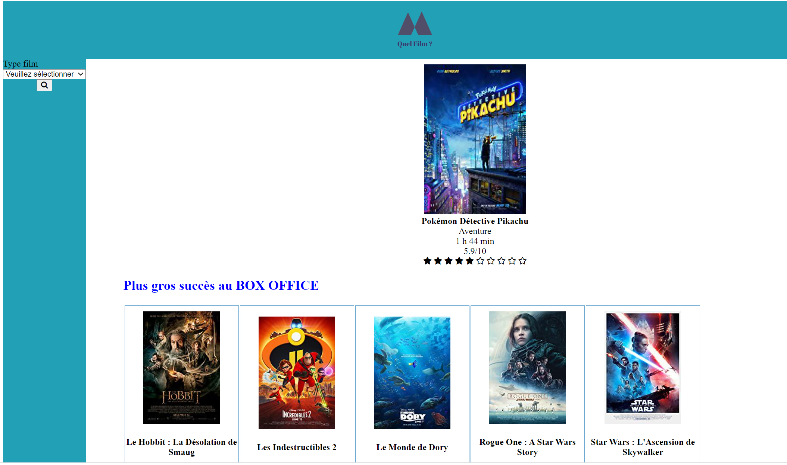

# **Projet Data Engineering - Comparatif de FILMS** #

### Introduction ### 

Les bases de données de films du type IMDB ou METACRITIC sont assez connus. \
Ils permettent à tout et chacun d'avoir le maximum d'information sur un film désiré.\
Notre projet a donc eu comme objectif de récupérer le maximum d'information de différents sites de base de données de films(IMDB, SENSCRITIQUE).\
Pour après déjà d'avoir une fiche de film plus complète étant donnée que les informations viendront de différents sites. \
Et puis en comparant les différentes notes des différents sites de pouvoir dresser des moyennes de films plus "complètes". \

###  Guide Utilisateur ### 

### Le Lancement du dashboard ###

Le lancement du dashboard se fait avec l'instruction : **python main.py**.

### Description du dashboard ###

Au lancement du dashboard, l'utilisateur se retrouve face à une page où au 1er plan il y a une fiche d'un film, un film aléatoire de la base de donnée. \
Juste en dessous il pourra observer différentes partie de liste de films, en cliquant sur le nom de la liste, l'utilisateur aura accès à la liste complète. \

